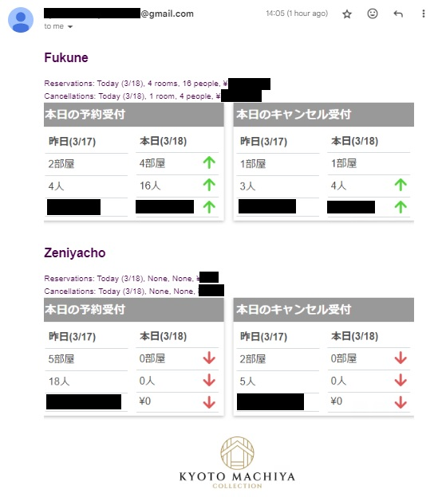

# Hotel Reservation Update Automation Script
I wrote this script for the Real Estate company Value-Build. It automates the daily task of retrieving reservation and cancellation information and reporting it to other staff. Feel free to adapt this to script to suit your needs.
This Python script automates the process of fetching and compiling reservation and cancellation data for hotels, and then sending a daily update email. It utilizes Google Sheets for configuration and data storage, web scraping for data extraction, and email for communication.



## Features
- **Automated Data Extraction**: Scrapes reservation and cancellation data from specified hotel management websites.
- **Google Sheets Integration**: Reads configuration details like hotel credentials and email settings from a Google Sheets document.
- **Email Updates**: Sends a daily email with the extracted data, including screenshots of the reservation and cancellation tables.
- **YAML Configuration for Email**: Uses a separate YAML file (`email.yaml`) for email-related configurations.
- **HTML Email Body**: Crafts emails with an HTML body, enhancing readability and allowing for the inclusion of images.

## Prerequisites
Before using this script, you should have:

- Python installed on your machine.
- Access to a Google Cloud Project with the Google Sheets API enabled.
- A service account created within the Google Cloud Project, with a downloaded JSON credentials file.
- The necessary Python libraries installed, which can be done via `pip install -r requirements.txt`.

## Setup

### Google Sheets API
1. **Service Account and Credentials**: Place your service account's JSON credentials file in the script's directory and name it `credentials.json`.
2. **Google Sheets Sharing**: Share your Google Sheet with the email address associated with your service account.

### Dependencies
Install the required dependencies by running:

```
pip install playwright gspread google-auth beautifulsoup4 PyYAML ssl smtplib email
```

### Email Configuration
The email configuration is stored in email.yaml. This file should include the sender's email address, password, and the recipients' email addresses.

## File Structure
- `kyoto_machiya_update.py`: Python script for executing
- `email.yaml`: YAML file used to store email passwords and addresses (example only)
- `credentials.json`: JSON file containing credentials needed to access Google Sheets API (example only)
- `email_body.html`: HTML file for the email body. The actual HTML used in the script is embedded into the python file.

## Running the Script
This script is executed with:

```
python kyoto_machiya_update.py
```

## Customization
Tailor the script to fit your needs-
Google Sheets: Modify the sheet to include your hotel's specific data points.
Web Scraping Selectors: Adjust the CSS selectors in the script to match the HTML structure of your hotel's management system.
YAML and HTML Files: Edit email.yaml and the HTML email template to suit your email formatting and content preferences.

## Security Note
Ensure the email account used for sending updates has a secure password and consider using app-specific passwords if supported. Always follow best practices for handling sensitive information in scripts and configuration files.

## Disclaimer
This script involves web scraping, which may be against the terms of service of some websites. Ensure you have permission to scrape the websites in question and that your activities comply with their terms of service.
